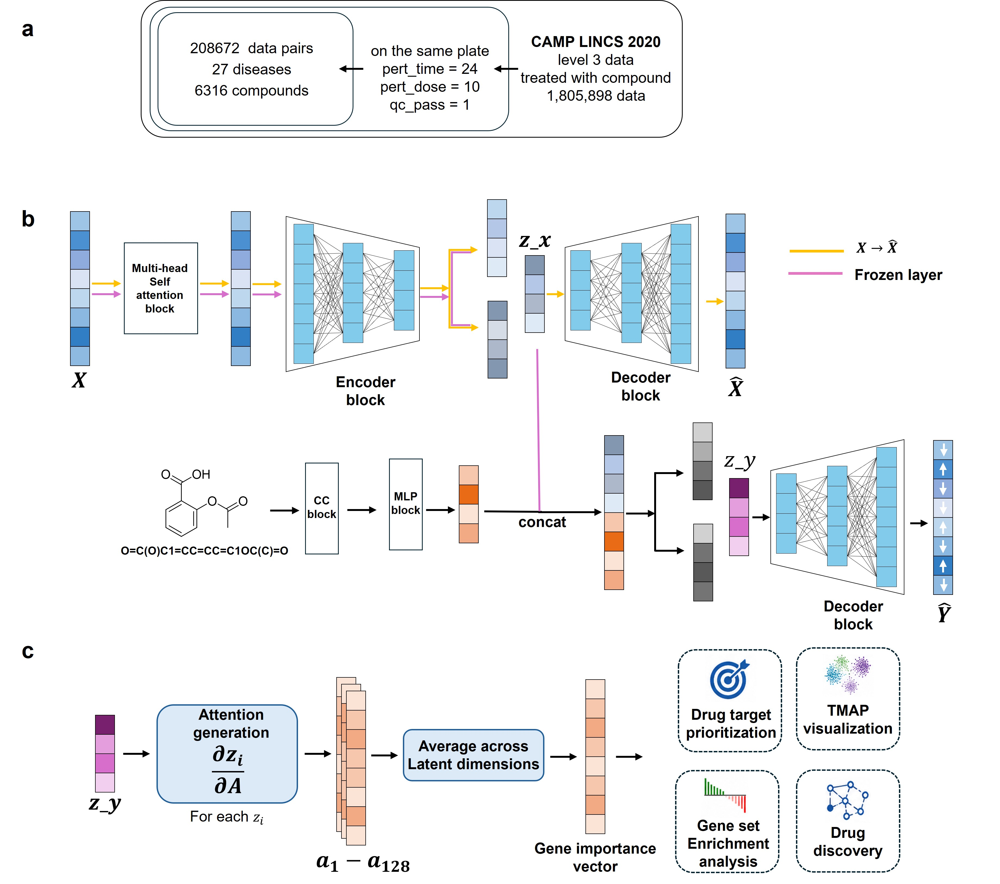

# iPerturbVAE

_A PyTorch project for drug perturbation gene-expression prediction, with control-expression reconstruction, compound-conditioned treatment prediction, and VAE attention interpretation._

---

## 📋 Project overview

`iPerturbVAE` implements a two-stage workflow for perturbation response modeling:

- Stage 1 trains `GeneOnlyAttnVAE_Conv` to reconstruct control gene expression and learn a latent representation over 978 landmark genes
- Stage 2 trains `CompoundConditionalVAE` to predict treated gene expression from frozen control-gene latent features plus compound fingerprints
- `predict.py` generates fold-level HDF5 outputs containing `ctls`, `pred`, and `true`
- `new_expvae.py` computes latent-dimension attention maps `Mi` and aggregate attention map `M` from prediction HDF5 files



## 🗂️ Repository layout

| Path | Purpose |
| --- | --- |
| `environment.yml` | Conda environment definition. The environment name is `cbfp`; key packages include Python 3.10, PyTorch, DGL, AnnData, h5py, scikit-learn, and TensorBoard |
| `models/stagevae.py` | Stage-1 gene-only attention + Conv1d VAE |
| `models/conditionvae.py` | Stage-2 compound conditional VAE and frozen gene encoder adapter |
| `models/gradcam.py` | Latent-space interpretation helper using an explanation-only 1D conv branch |
| `utils/dataloader.py` | HDF5 dataset loader returning `compound`, `gene_ctl`, and `gene_trt` |
| `utils/evaluation.py` | Per-gene R2 and Pearson evaluation helpers |
| `utils/rges.py` | Connectivity score / RGES utility functions |
| `trainer.py` | Distributed training script for the stage-1 gene-only VAE |
| `trainerctl2trt.py` | Single-process training script for stage-2 control + compound -> treatment prediction |
| `predict.py` | Prediction entry point for 5-fold conditional VAE checkpoints |
| `new_expvae.py` | Computes `Mi` and `M` attention outputs from `ctls` or `pred` datasets inside a prediction HDF5 |
| `data_splits/` | Saved train/validation/test split indices and 5-fold split indices |
| `checkpoints/` | Expected checkpoint output directory. The current repository does not include checkpoint files |

## 🚀 Setup

Create the Conda environment from `environment.yml`:

```bash
conda env create -f environment.yml
conda activate cbfp
```

If you are using an existing environment, verify the core runtime packages:

```bash
python -c "import torch, h5py, numpy, pandas, sklearn, scipy; print(torch.__version__)"
```

> ⚠️ **Note:** `environment.yml` includes exact build pins and a machine-specific `prefix:` value. If environment creation fails on another machine, remove the final `prefix:` line and retry.

## 📦 Data format

`H5GeneCompoundDataset` expects the input HDF5 file to contain at least these datasets:

| HDF5 key | Shape | Description |
| --- | --- | --- |
| `comp_ccfps` | `(N, 3200)` | Compound fingerprint |
| `gene_info_ctl` | `(N, full_gene_dim)` | Control-state gene expression |
| `gene_info_trt` | `(N, full_gene_dim)` | Treatment-state gene expression |

`utils/dataloader.py` reads a CSV with an `idx_position` column and uses it to select and order 978 landmark genes from the full gene-expression vectors:

```python
/home/liuxiaoping/cbfp_vae/dataprocess/data/landmark_gene_idx_positions.csv
```

Before running on a new machine, update these hard-coded paths or pass explicit arguments where available:

| File | Current path or setting | Action |
| --- | --- | --- |
| `utils/dataloader.py` | `/home/liuxiaoping/cbfp_vae/dataprocess/data/landmark_gene_idx_positions.csv` | Change to the local landmark gene index CSV |
| `trainer.py` | `../cbfp_vae/dataprocess/data_qcpass_unique_by_ctl.h5` | Change to the stage-1 training HDF5 |
| `trainerctl2trt.py` | `/home/liuxiaoping/cbfp_vae/dataprocess/data_qcpass_filtered.h5` | Change to the stage-2 training HDF5 |
| `predict.py` | `./dataprocess/data_qcpass_filtered.h5` | Override with `--h5_path` |

## 🧠 Training

### Stage 1: train the gene-only VAE

`trainer.py` uses `torch.distributed` with the NCCL backend and is intended for multi-GPU DDP training. It reads:

```text
data_splits/train_indicesall.npy
data_splits/val_indicesall.npy
data_splits/test_indicesall.npy
```

The best checkpoint is saved to:

```text
./checkpoints/512best_gene_only_attn_vae_convctl2ctl.pt
```

Example:

```bash
torchrun --nproc_per_node=2 trainer.py
```

For single-GPU or CPU debugging, reduce `batch_size` and `num_workers` first. You will also need to remove or adapt DDP initialization, `DistributedSampler`, and `LOCAL_RANK` usage.

### Stage 2: train the compound conditional VAE

`trainerctl2trt.py` loads the stage-1 checkpoint, freezes the `gene_ctl -> z0` encoder, and trains a conditional VAE for `compound + z0 -> gene_trt`.

The script currently expects the pretrained gene checkpoint at:

```text
./checkpoints/best_gene_only_attn_vae_convctl2ctl.pt
```

The best stage-2 checkpoint is saved to:

```text
./checkpoints/pc3best_ctl_compound_to_trt_condvae.pt
```

Example:

```bash
python trainerctl2trt.py
```

> ⚠️ **Checkpoint naming:** `trainer.py` saves `512best_gene_only_attn_vae_convctl2ctl.pt`, while `trainerctl2trt.py` reads `best_gene_only_attn_vae_convctl2ctl.pt` by default. Rename the file or update `pretrained_ckpt` before running stage 2.

## 🔮 Prediction

`predict.py` loads a conditional VAE checkpoint and writes predictions for the full HDF5 dataset. The output HDF5 contains:

| Output key | Description |
| --- | --- |
| `ctls` | Input control gene expression |
| `pred` | Predicted treatment gene expression |
| `true` | Ground-truth treatment gene expression |

Default random-split checkpoint naming:

```text
./checkpoints/best_ctl_compound_to_trt_condvae_fold{fold}.pt
```

Default disease-split checkpoint naming:

```text
./checkpoints/best_ctl_compound_to_trt_condvaesplitbydisease_fold{fold}.pt
```

Example:

```bash
python predict.py \
  --h5_path ./dataprocess/data_qcpass_filtered.h5 \
  --split_type random \
  --fold 1 \
  --ckpt_dir ./checkpoints \
  --out_dir ./results_cv5
```

If your checkpoint does not follow the default fold naming convention, pass it directly:

```bash
python predict.py \
  --h5_path ./dataprocess/data_qcpass_filtered.h5 \
  --split_type random \
  --fold 1 \
  --cond_ckpt ./checkpoints/pc3best_ctl_compound_to_trt_condvae.pt \
  --out_h5 ./results_cv5/pred_random_fold1.h5
```

## 📊 Attention interpretation

`new_expvae.py` reads either `ctls` or `pred` from a prediction HDF5, loads the gene-only VAE checkpoint, and computes:

- `Mi`: attention contribution for each sample, latent dimension, and gene
- `M`: aggregate gene attention averaged across latent dimensions

Example:

```bash
python new_expvae.py \
  --h5_path ./results_cv5/pred_random_fold1.h5 \
  --dataset_key pred \
  --ckpt_path ./checkpoints/best_gene_only_attn_vae_convctl2ctl.pt \
  --batch_size 32 \
  --latent_dim 128 \
  --output_path ./results_cv5/attention_pred_random_fold1.npz
```

The output is a compressed `.npz` file containing `Mi`, `M`, and `dataset_key`.

## 🧪 Smoke test

Run the stage-1 model smoke test to verify that the model forward and backward pass work:

```bash
python models/stagevae.py
```

Expected output:

```text
y_hat: torch.Size([4, 978]) attn_seq: torch.Size([4, 978, 128])
```

## ⚙️ Common settings

| Setting | Default | Location |
| --- | --- | --- |
| `gene_dim` | `978` | Fixed in multiple model and script files |
| `compound_dim` | `3200` | `predict.py`, `trainerctl2trt.py`, `H5GeneCompoundDataset` |
| `z_dim` / `latent_dim` | `128` | `predict.py`, `trainerctl2trt.py`, `new_expvae.py` |
| Stage-1 epochs | `200` | `trainer.py` |
| Stage-2 epochs | `200` | `trainerctl2trt.py` |
| Stage-1 batch size | `32` | `trainer.py` |
| Stage-2 batch size | `64` | `trainerctl2trt.py` |
| TensorBoard logs | `./runs/...` | `trainer.py`, `trainerctl2trt.py` |

View training curves:

```bash
tensorboard --logdir ./runs
```

## ⚠️ Known caveats

- `checkpoints/` currently contains no model weights; train models first or place compatible checkpoints there
- `utils/dataloader.py` contains an absolute path to the landmark gene index CSV
- `trainer.py` requires a DDP launch context; plain `python trainer.py` will usually fail because `LOCAL_RANK` and NCCL initialization are missing
- `utils/predictor.py` imports `models.model`, which is not present in this repository; the current prediction entry point is `predict.py`
- Stage-1 checkpoint save and load names are inconsistent across scripts
- Default `num_workers` values are high; lower them to `0`, `2`, or `4` for debugging on smaller machines

## 📄 Output conventions

| File type | Example | Contents |
| --- | --- | --- |
| Stage-1 checkpoint | `checkpoints/best_gene_only_attn_vae_convctl2ctl.pt` | Gene-only VAE weights |
| Stage-2 checkpoint | `checkpoints/best_ctl_compound_to_trt_condvae_fold1.pt` | Conditional VAE weights and metadata |
| Prediction HDF5 | `results_cv5/pred_random_fold1.h5` | `ctls`, `pred`, `true` |
| Attention NPZ | `results_cv5/attention_pred_random_fold1.npz` | `Mi`, `M` |
| TensorBoard logs | `runs/...` | Training loss, KL, R2, and Pearson metrics |
